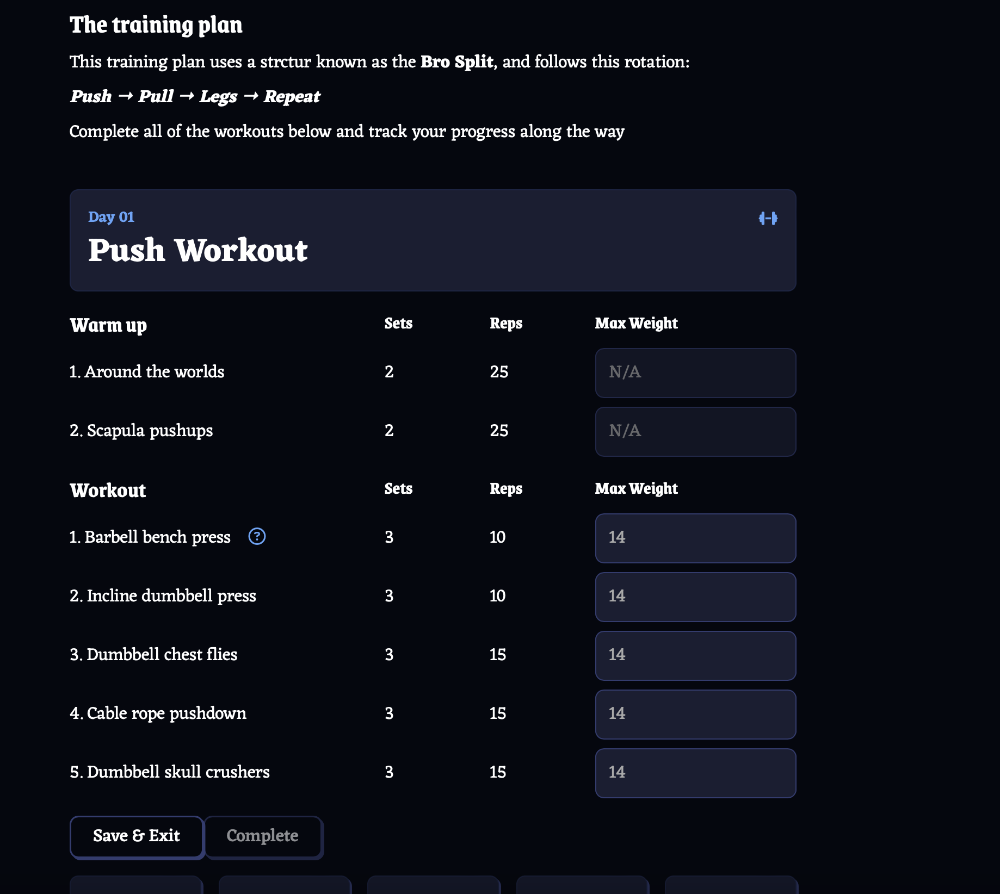

# Fitness Application using ReactJS + Vite

## Application Guidelines

This fitness application provides a basic 30-day workout plan that users can follow to kickstart their fitness journey.

Upon starting the workout program, only the Day 1 workout will be available, while the subsequent days will be locked. To progress through the program, users must complete the latest unlocked workout day.

A workout day is considered complete once the user has finished both the warm-up and the workout exercises. The workout exercise includes fields for inputting the maximum weight used during the session. Please note that these fields are required to be filled in to complete the workout.

Once a workout day is completed, the next consecutive day's workout will be unlocked.

If you require further instructions for any workout, you can press the icon next to the workout name to view a description.

[Site Link](https://sabrina-fitness-app.netlify.app)

## Run Application locally

1. Clone this repository.
2. Open your terminal and navigate to the project directory.
3. Run the following command: `npm run dev`.
4. Copy the provided HTTP link and paste it into your preferred web browser.

## Structure of the repo

The basic structure of the application can be found in `App.jsx`. The main JavaScript files for each component are located in the components folder. The primary CSS files used in this application are `index.css` and `fanta.css`.
